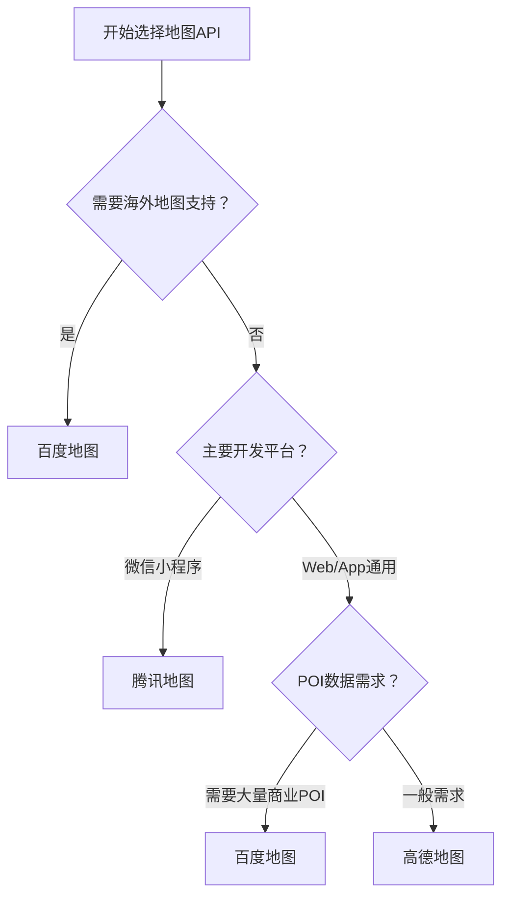

# 中国地图API对比与选择指南

## 概述

由于Google Maps API在中国地区访问受限，本文档详细对比了中国主流地图API服务，帮助开发者选择最适合的地图解决方案。

## 主流地图API对比

### 1. 高德地图API

**官网：** https://lbs.amap.com/

#### 优势
- 🏆 **开发者体验最佳**：文档详细，示例丰富，社区活跃
- 🎯 **功能完善**：支持2D/3D地图、实时路况、路径规划、地理围栏等
- 📱 **多端支持**：Web、Android、iOS、小程序全覆盖
- 🔧 **易于集成**：API设计简洁，上手快速
- 🚀 **性能优秀**：响应速度快，渲染流畅

#### 劣势
- 🌍 **仅支持中国地区**：不提供海外地图数据
- 📍 **POI数量相对较少**：商业POI不如百度丰富
- 💰 **商业化限制**：免费额度有限，商用需付费

#### 适用场景
- 通用LBS应用开发
- 导航和出行类应用
- 需要高质量开发体验的项目
- 中小型企业和个人开发者

#### 技术特点
```javascript
// 高德地图特色功能
- 坐标系：GCJ-02（国测局坐标）
- 3D地图支持
- 实时路况和路径优化
- 地理围栏和轨迹纠偏
- 天气查询集成
```

### 2. 百度地图API

**官网：** https://lbsyun.baidu.com/

#### 优势
- 📊 **POI数据最丰富**：超过1.8亿个兴趣点数据
- 🌏 **全球地图支持**：唯一支持海外地图的中国地图服务
- 🛰️ **北斗高精度定位**：厘米级定位精度
- 🔍 **AI能力强大**：集成百度AI技术，如图像识别
- 📈 **数据可视化**：强大的地图可视化和分析能力

#### 劣势
- 🗺️ **坐标系不兼容**：使用BD-09坐标系，需要转换
- 📚 **文档相对较少**：示例代码和教程不如高德完善
- 💸 **成本较高**：海外服务和高级功能收费较高
- 🐛 **稳定性问题**：部分开发者反馈API稳定性有待提升

#### 适用场景
- 需要海外地图支持的应用
- 商业POI数据需求量大的项目
- 物流和轨迹分析应用
- 大型企业级应用

#### 技术特点
```javascript
// 百度地图特色功能
- 坐标系：BD-09（百度坐标）
- 全球地图覆盖
- 鹰眼轨迹服务
- 室内地图和导航
- AI向导功能
```

### 3. 腾讯地图API

**官网：** https://lbs.qq.com/

#### 优势
- 📱 **微信生态集成**：微信小程序开发支持最佳
- 🎨 **3D效果出色**：城市建模和3D可视化效果好
- 🔗 **腾讯生态**：与QQ、微信等产品深度集成
- 💡 **创新功能**：支持AR导航、室内定位等新技术

#### 劣势
- 🔧 **功能相对较少**：API功能不如高德和百度丰富
- 👥 **社区支持有限**：开发者社区和文档相对较少
- 🌍 **仅支持中国地区**：不提供海外地图服务
- 📊 **POI数据一般**：商业数据不如百度丰富

#### 适用场景
- 微信小程序开发
- 需要3D可视化效果的应用
- 社交类位置服务
- 腾讯生态内的应用

#### 技术特点
```javascript
// 腾讯地图特色功能
- 坐标系：GCJ-02（国测局坐标）
- 3D城市建模
- 微信小程序SDK
- 个性化地图样式
- 位置社交功能
```

## 详细功能对比

### 基础功能对比

| 功能特性 | 高德地图 | 百度地图 | 腾讯地图 |
|----------|----------|----------|----------|
| **地图显示** | ⭐⭐⭐⭐⭐ | ⭐⭐⭐⭐ | ⭐⭐⭐⭐ |
| **标记和覆盖物** | ⭐⭐⭐⭐⭐ | ⭐⭐⭐⭐ | ⭐⭐⭐⭐ |
| **路径规划** | ⭐⭐⭐⭐⭐ | ⭐⭐⭐⭐ | ⭐⭐⭐ |
| **实时路况** | ⭐⭐⭐⭐⭐ | ⭐⭐⭐⭐ | ⭐⭐⭐ |
| **地理编码** | ⭐⭐⭐⭐⭐ | ⭐⭐⭐⭐ | ⭐⭐⭐⭐ |
| **POI搜索** | ⭐⭐⭐⭐ | ⭐⭐⭐⭐⭐ | ⭐⭐⭐ |
| **定位服务** | ⭐⭐⭐⭐ | ⭐⭐⭐⭐⭐ | ⭐⭐⭐⭐ |

### 开发体验对比

| 开发体验 | 高德地图 | 百度地图 | 腾讯地图 |
|----------|----------|----------|----------|
| **文档质量** | ⭐⭐⭐⭐⭐ | ⭐⭐⭐ | ⭐⭐⭐ |
| **示例代码** | ⭐⭐⭐⭐⭐ | ⭐⭐⭐ | ⭐⭐⭐ |
| **社区支持** | ⭐⭐⭐⭐⭐ | ⭐⭐⭐ | ⭐⭐ |
| **API设计** | ⭐⭐⭐⭐⭐ | ⭐⭐⭐ | ⭐⭐⭐⭐ |
| **调试工具** | ⭐⭐⭐⭐ | ⭐⭐⭐ | ⭐⭐⭐ |
| **更新频率** | ⭐⭐⭐⭐ | ⭐⭐⭐ | ⭐⭐⭐ |

### 数据质量对比

| 数据质量 | 高德地图 | 百度地图 | 腾讯地图 |
|----------|----------|----------|----------|
| **地图精度** | ⭐⭐⭐⭐⭐ | ⭐⭐⭐⭐ | ⭐⭐⭐⭐ |
| **POI数量** | ⭐⭐⭐⭐ | ⭐⭐⭐⭐⭐ | ⭐⭐⭐ |
| **路况准确性** | ⭐⭐⭐⭐⭐ | ⭐⭐⭐⭐ | ⭐⭐⭐ |
| **更新及时性** | ⭐⭐⭐⭐⭐ | ⭐⭐⭐⭐ | ⭐⭐⭐⭐ |
| **覆盖范围** | 中国 | 全球 | 中国 |

## 选择建议

### 🎯 推荐选择流程



### 📋 具体场景推荐

#### 1. 通用LBS应用 → **高德地图**
- 外卖配送、打车出行、位置社交
- 优势：开发体验好，功能完善，性能稳定

#### 2. 商业应用 → **百度地图**
- 店铺查找、商圈分析、营销推广
- 优势：POI数据丰富，商业信息完整

#### 3. 物流追踪 → **百度地图**
- 货运跟踪、轨迹分析、路径优化
- 优势：鹰眼轨迹服务，全球覆盖

#### 4. 微信生态 → **腾讯地图**
- 微信小程序、公众号应用
- 优势：微信集成度高，用户体验好

#### 5. 海外业务 → **百度地图**
- 跨境电商、国际物流、海外旅游
- 优势：唯一支持全球地图的中国服务

## 成本对比

### 免费额度对比

| 服务商 | 地图加载 | 定位服务 | 路径规划 | POI搜索 |
|--------|----------|----------|----------|----------|
| **高德地图** | 30万次/天 | 10万次/天 | 5万次/天 | 10万次/天 |
| **百度地图** | 10万次/天 | 6万次/天 | 5万次/天 | 10万次/天 |
| **腾讯地图** | 10万次/天 | 5万次/天 | 5万次/天 | 5万次/天 |

### 付费价格（参考）

| 服务类型 | 高德地图 | 百度地图 | 腾讯地图 |
|----------|----------|----------|----------|
| **基础地图** | 0.5-2元/千次 | 1-3元/千次 | 0.5-2元/千次 |
| **路径规划** | 2-5元/千次 | 3-6元/千次 | 2-4元/千次 |
| **POI搜索** | 1-3元/千次 | 2-4元/千次 | 1-3元/千次 |

*注：具体价格以官方最新报价为准*

## 迁移指南

### 从Google Maps迁移

#### 1. 功能映射表

| Google Maps功能 | 高德地图替代 | 百度地图替代 | 腾讯地图替代 |
|----------------|-------------|-------------|-------------|
| `google.maps.Map` | `AMap.Map` | `BMap.Map` | `TMap.Map` |
| `google.maps.Marker` | `AMap.Marker` | `BMap.Marker` | `TMap.MultiMarker` |
| `google.maps.Polyline` | `AMap.Polyline` | `BMap.Polyline` | `TMap.MultiPolyline` |
| `google.maps.InfoWindow` | `AMap.InfoWindow` | `BMap.InfoWindow` | `TMap.InfoWindow` |
| `google.maps.Geocoder` | `AMap.Geocoder` | `BMap.Geocoder` | `TMap.service.Geocoder` |

#### 2. 代码迁移示例

**Google Maps:**
```javascript
const map = new google.maps.Map(document.getElementById('map'), {
  center: {lat: 39.9042, lng: 116.4074},
  zoom: 12
});
```

**高德地图:**
```javascript
const map = new AMap.Map('map', {
  center: [116.4074, 39.9042],
  zoom: 12
});
```

#### 3. 注意事项
- **坐标格式差异**：Google Maps使用`{lat, lng}`，中国地图多使用`[lng, lat]`
- **坐标系转换**：需要处理WGS84到GCJ-02/BD-09的转换
- **API调用方式**：事件监听、覆盖物添加方式有差异

## 总结

### 🏆 综合推荐排名

1. **高德地图** - 最佳选择
   - 适合大多数中国本土LBS应用开发
   - 开发体验和文档质量最佳

2. **百度地图** - 特定场景首选
   - 需要海外支持或丰富POI数据时选择
   - 企业级应用的可靠选择

3. **腾讯地图** - 生态特化
   - 微信小程序开发的最佳选择
   - 3D可视化效果出色

### 💡 最终建议

- **新项目**：优先考虑高德地图，开发体验最佳
- **商业项目**：如需丰富POI数据，选择百度地图
- **小程序**：腾讯地图是微信生态的最佳选择
- **海外业务**：百度地图是唯一选择
- **预算有限**：高德地图免费额度最高

选择地图API时，建议根据具体业务需求、技术团队能力和预算情况综合考虑，必要时可以进行小规模试用对比。